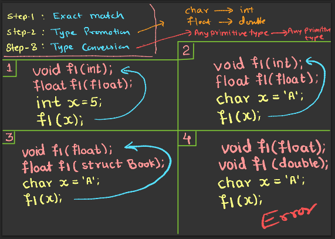

# C++ Input & Output (I/O)

## 1️⃣ `printf` (from C)
- ✅ **It is a predefined function** in C and C++ (`stdio.h` in C, `cstdio` in C++).
- ✅ It is **not an object**, but a function.
- ✅ Uses **format specifiers** (e.g., `%d`, `%f`, `%s`).
- ✅ **Example:**
  ```cpp
  #include <cstdio>
  int main() {
      printf("Hello, %s! Your score is %d\n", "Jay", 95);
      return 0;
  }
  ```

---

## 2️⃣ `cout` (from C++)
- ✅ **It is a predefined object** of the `ostream` class.
- ✅ Works with the **insertion operator (`<<`)**.
- ✅ Requires `#include <iostream>`.
- ✅ **Example:**
  ```cpp
  #include <iostream>
  using namespace std;
  int main() {
      cout << "Hello, Jay!" << endl;
      return 0;
  }
  ```

---

## 3️⃣ `scanf` (from C)
- ✅ **It is a predefined function**, not an object.
- ✅ Works with **format specifiers** like `%d`, `%f`, `%s`.
- ✅ **Example:**
  ```cpp
  #include <cstdio>
  int main() {
      int age;
      printf("Enter your age: ");
      scanf("%d", &age);
      printf("You are %d years old.\n", age);
      return 0;
  }
  ```

---

## 4️⃣ `cin` (from C++)
- ✅ **It is a predefined object** of the `istream` class.
- ✅ Uses the **extraction operator (`>>`)**.
- ✅ Requires `#include <iostream>`.
- ✅ **Example:**
  ```cpp
  #include <iostream>
  using namespace std;
  int main() {
      int age;
      cout << "Enter your age: ";
      cin >> age;
      cout << "You are " << age << " years old." << endl;
      return 0;
  }
  ```

---

# 🖥️ 5️⃣ `iostream` in C++
- ✅ `iostream` is a **C++ standard library** that declares **cout, cin, cerr, clog**.
- ✅ **Before 2003**: `#include <iostream.h>` was used (non-standard).  
- ✅ **After 2003**: Only `#include <iostream>` is used (standard).  
- ✅ **Example:**
  ```cpp
  #include <iostream> // Standard way
  using namespace std;
  int main() {
      cout << "C++ uses <iostream> for I/O." << endl;
      return 0;
  }
  ```

---

# 6️⃣ `namespace` in C++
- ✅ **Namespaces** prevent naming conflicts in large projects.
- ✅ `std::` is the **standard namespace** for C++ STL (cout, cin, etc.).
- ✅ **Example Without `using namespace std;`**
  ```cpp
  #include <iostream>
  int main() {
      std::cout << "Hello, World!" << std::endl;
      return 0;
  }
  ```
- ✅ **Example With `using namespace std;`**
  ```cpp
  #include <iostream>
  using namespace std;
  int main() {
      cout << "Hello, World!" << endl;
      return 0;
  }
  ```

---

# 7️⃣ Creating a Custom Namespace in C++
- ✅ You can define your own namespace to organize code.
- ✅ **Example:**
  ```cpp
  #include <iostream>
  namespace myNamespace {
      int x = 5;
      void greet() {
          std::cout << "Hello from myNamespace!" << std::endl;
      }
  }
  int main() {
      std::cout << "Value of x: " << myNamespace::x << std::endl;
      myNamespace::greet(); // Calling function from custom namespace
      return 0;
  }
  ```

---

# 8️⃣ `using` Keyword in C++
- ✅ The `using` keyword allows us to avoid writing the full namespace every time.
- ✅ **Example:**
  ```cpp
  #include <iostream>
  using namespace std; // Now we can use cout, cin directly
  int main() {
      cout << "Hello, World!" << endl; // No need to write std::cout
      return 0;
  }
  ```
- ✅ **Using for specific items:**
  ```cpp
  #include <iostream>
  using std::cout; // Only importing cout
  int main() {
      cout << "Using only cout from std!" << std::endl;
      return 0;
  }
  ```
- ✅ **Using with custom namespace:**
  ```cpp
  #include <iostream>
  namespace customNS {
      int x = 10;
  }
  using namespace customNS; // Now we can use x directly
  int main() {
      std::cout << "Value of x: " << x << std::endl;
      return 0;
  }
  ```

✅ **This document explains the key concepts of I/O, namespaces, and the `using` keyword in C++.** 🚀

# Functions in C++

### 📚 **Saurabh Shukla (MySirG) - C++ In Depth**

## 📌 **Agenda**
1. Inline Functions
2. Default Arguments
3. Reference Variables
4. Call by Value
5. Call by Address
6. Call by Reference

---

## **1️⃣ Inline Functions**
### 🔹 What is an Inline Function?
- Used to **save execution time** when a function is **called multiple times**.
- Normal function calls involve extra overhead for:
  - Jumping to the function
  - Saving registers
  - Pushing arguments onto the stack
  - Returning to the calling function
- **Inline functions eliminate this overhead** by replacing the function call with its actual code at compile time.
- It is a **request, not a command**—the compiler may ignore it in some cases.

### 🔹 When Will the Compiler Ignore `inline`?
- Functions containing **loops, `switch`, or `goto`**
- Functions with **recursion**
- Functions containing **static variables**

### 🔹 Example:
```cpp
inline int add(int x, int y) {
    return x + y;
}
```

---

## **2️⃣ Default Arguments**
### 🔹 What are Default Arguments?
- We can **set default values** for function parameters.
- If an argument is not provided, the **default value is used**.
- **Not all parameters need default values.**
- A function **cannot have a non-default argument after a default argument**.

### 🔹 Example:
```cpp
#include <iostream>
using namespace std;

void greet(string name = "User") {
    cout << "Hello, " << name << "!" << endl;
}

int main() {
    greet();          // Uses default value "User"
    greet("Saurabh"); // Uses provided argument "Saurabh"
    return 0;
}
```

---

## **3️⃣ Reference Variables**
### 🔹 What is a Reference Variable?
- A **reference** is an **alias (another name)** for an existing variable.
- **Syntax:** `datatype &ref = var;`
- Unlike pointers, references **must be initialized when declared**.

### 🔹 Example:
```cpp
int x = 5;
int &y = x;  // y is a reference to x

y++;  // Modifies x
cout << x;  // Output: 6
```

| Concept | Syntax | Memory Address |
|---------|--------|---------------|
| **Ordinary Variable** | `int x = 5;` | `1000` |
| **Pointer Variable** | `int *p = &x;` | `2000 (stores address 1000)` |
| **Reference Variable** | `int &y = x;` | `1000 (same as x)` |

---

## **4️⃣ Call by Value vs. Call by Address vs. Call by Reference**
### 🔹 Function Call Methods
| **Method** | **Function Signature** | **Example Call** |
|-----------|--------------------|----------------|
| **Call by Value** | `void f1(int a, int b);` | `f1(x, y);` |
| **Call by Address** | `void f2(int *p, int *q);` | `f2(&x, &y);` |
| **Call by Reference** | `void f3(int &m, int &n);` | `f3(x, y);` |

### 🔹 Examples:
#### **1️⃣ Call by Value** (Passes a copy, original values remain unchanged)
```cpp
void f1(int a, int b) {
    a += 10;
    b += 10;
}
```
#### **2️⃣ Call by Address** (Uses pointers to modify original values)
```cpp
void f2(int *p, int *q) {
    *p += 10;
    *q += 10;
}
```
#### **3️⃣ Call by Reference** (Uses references to modify original values)
```cpp
void f3(int &m, int &n) {
    m += 10;
    n += 10;
}
```

### 🔹 Memory Representation:
| **Concept** | **Address in Memory** | **Example** |
|------------|------------------|------------|
| **Call by Value** | `x (1000) → 3`, `y (2000) → 4` | `f1(x, y);` (Values unchanged) |
| **Call by Address** | `x (1000) → 3`, `y (2000) → 4` | `f2(&x, &y);` (Values modified) |
| **Call by Reference** | `x (1000) → 3`, `y (2000) → 4` | `f3(x, y);` (Values modified) |

---

## **🔹 Summary**
- **Inline Functions:** Reduce function call overhead.
- **Default Arguments:** Allow optional parameters in functions.
- **Reference Variables:** Act as aliases for existing variables.
- **Call by Value:** Passes a copy (does not modify original).
- **Call by Address:** Uses pointers (modifies original).
- **Call by Reference:** Uses references (modifies original, more readable than pointers).

✅ **This document summarizes function concepts in C++ for efficient programming.** 🚀

# Function Overloading - Notes

## 📚 **Saurabh Shukla (MySirG) - C++ In Depth**

## 📌 **Agenda**
1. OOP Principles
2. Polymorphism
3. Function Overloading

---

## **1️⃣ OOP Principles**
- **Encapsulation**
- **Data Hiding**
- **Abstraction**
- **Polymorphism**
- **Inheritance**

---

## **2️⃣ Polymorphism**
- **Polymorphism** is a Greek word that means **many-shaped**.
- **Types of Polymorphism in C++:**
  1. **Function Overloading** → **Compile Time Polymorphism**
  2. **Operator Overloading** → **Compile Time Polymorphism**
  3. **Virtual Function** → **Run Time Polymorphism**
   
---

## **3️⃣ Function Overloading**
### 🔹 What is Function Overloading?
- Multiple functions **with the same name** but **different parameters**.
- The function to be called is determined at **compile-time** based on the argument list.
- Also known as **Function Polymorphism**.

### 🔹 Function Overloading in C vs C++
| **Language** | **Rules** |
|-------------|----------|
| **C Language** | Function names must be **unique**. Two functions **cannot have the same name**, even if their arguments are different. |
| **C++ Language** | Function **signatures** must be unique (name + parameters). Function names can be **the same**, as long as parameters are different. |

### 🔹 Function Signature in C++
A **function signature** consists of:
1. **Function name**
2. **Arguments**

⚠️ **Return type is NOT part of the function signature**.

---

## **4️⃣ Early Binding (Compile-Time Binding)**
- The **compiler binds (maps) a function call** to the appropriate function **at compile time**.
- **Early Binding** occurs in function overloading.

### 🔹 Example:
```cpp
#include <iostream>
using namespace std;

void print(int x) {
    cout << "Integer: " << x << endl;
}

void print(double x) {
    cout << "Double: " << x << endl;
}

void print(string x) {
    cout << "String: " << x << endl;
}

int main() {
    print(5);        // Calls print(int)
    print(6.5);      // Calls print(double)
    print("Hello"); // Calls print(string)
    return 0;
}
```
✅ **Output:**
```
Integer: 5
Double: 6.5
String: Hello
```

---

## **5️⃣ Function Overloading Resolution (3-Step Rule)**
When the compiler encounters a function call:
1. **Exact Match** → If an exact match is found, it is selected.
2. **Type Promotion** → If no exact match, the compiler tries to **promote** the argument types (e.g., `char → int`, `float → double`).
3. **Conversion Using Constructors or Casting** → If needed, the compiler tries to convert the arguments using constructors or casting.

### 🔹 Example:
```cpp
void display(int x);      // Function 1
void display(double x);   // Function 2

int main() {
    display('A');  // 'A' (char) gets promoted to int → Calls Function 1
    display(10.5f); // float gets promoted to double → Calls Function 2
    return 0;
}
```

---

## **6️⃣ Summary**
✅ Function Overloading allows **multiple functions with the same name** but different parameters.
✅ The compiler **chooses the correct function at compile-time** (Early Binding).
✅ The function signature must be **unique** (name + parameters, NOT return type).
✅ Function resolution follows **Exact Match → Type Promotion → Conversion**.

🚀 **Function Overloading is a key feature of Compile-Time Polymorphism in C++!**

# Structure in C++

## 📚 **Saurabh Shukla (MySirG) - C++ In Depth**

## 📌 **Agenda**
1. Recall Structure in C Language
2. Use of Structure in C++ Programs
3. New Rules in C++ Structure

---

## **1️⃣ Structure in C**
### 🔹 What is a Structure?
- A **structure** is a collection of **dissimilar elements** grouped together.
- Structures allow us to create **custom data types**.

### 🔹 Types of Data in C++
| **Data Type** | **Example** |
|-------------|------------|
| **Primitive Data Types** | `int`, `char`, `float`, `double` |
| **User-defined Data Types** | `struct`, `class`, `union` |
| **Secondary Data Types** | Arrays, Pointers |

---

## **2️⃣ Defining a Structure (Creating a Type)**
```cpp
struct Book {
    int bookid;
    char title[20];
    float price;
};
```
- This creates a **custom data type** named `Book`.
- The structure contains **three member variables**:
  - `bookid` (integer)
  - `title` (character array)
  - `price` (floating-point number)

### 🔹 Global vs Local Structure Definition
- **Global Structure:** Defined outside `main()` and available throughout the program.
- **Local Structure:** Defined inside a function and accessible only within that function.

---

## **3️⃣ Using Structures in C++**
### 🔹 Example: Structure to Handle Book Records
```cpp
#include <iostream>
using namespace std;

struct Book {
    int bookid;
    char title[20];
    float price;

    void InputBook() {
        cout << "Enter Book ID: ";
        cin >> bookid;
        cout << "Enter Title: ";
        cin >> title;
        cout << "Enter Price: ";
        cin >> price;
    }

    void DisplayBook() {
        cout << "Book ID: " << bookid << endl;
        cout << "Title: " << title << endl;
        cout << "Price: " << price << endl;
    }
};

int main() {
    Book b1;
    b1.InputBook();
    b1.DisplayBook();
    return 0;
}
```
✅ **This program:**
- Defines a `Book` structure.
- Includes two **member functions** (`InputBook()` and `DisplayBook()`).
- Takes book details as input and displays them.

---

## **4️⃣ What’s New in C++ Structures?**
### 🔹 Key Differences Between C and C++ Structures
1. **Use of `struct` Keyword is Optional**
   - In **C**, you must use `struct` while declaring structure variables.
   - In **C++**, you can omit `struct` when declaring variables.

   **Example:**
   ```cpp
   struct Book b1; // Required in C
   Book b2;        // Allowed in C++
   ```

2. **Structures Can Have Member Functions**
   - In C++, structures can contain **functions** (like a class).
   - This was not possible in C.

3. **Access Specifiers in Structures**
   - C++ allows **`public`, `private`, and `protected`** access specifiers inside structures.
   - By default, structure members are **public** in C++ (unlike `class`, where they are private).

   **Example:**
   ```cpp
   struct Employee {
   private:
       int salary;
   public:
       void setSalary(int s) { salary = s; }
       int getSalary() { return salary; }
   };
   ```

---

## **5️⃣ Summary**
✅ **Structures in C++** are similar to C but with additional features.
✅ **Member functions** can be defined inside structures.
✅ **Access specifiers** (`public`, `private`) can be used in structures.
✅ The `struct` keyword **is optional** when declaring structure variables in C++.

🚀 **C++ Structures are more powerful and flexible than C structures!**

# Difference Between Structure in C and Structure in C++

| Feature | Structure in **C** | Structure in **C++** |
|----------|----------------|----------------|
| **Definition** | `struct` is used to define a structure. | Same `struct` keyword, but with added features. |
| **Member Functions** | ❌ **Not allowed** (Only data members). | ✅ **Allowed** (Can have functions inside). |
| **Data Hiding (Encapsulation)** | ❌ **Not possible** (No access specifiers). | ✅ **Possible** (`public`, `private`, `protected` available). |
| **Inheritance** | ❌ **Not Supported** | ✅ **Supported** (A structure can inherit another structure or class). |
| **Access Specifiers** | ❌ **All members are public by default.** | ✅ **By default, members are public, but you can use `private` & `protected`.** |
| **Creating Objects** | `struct` keyword is **mandatory** when declaring variables. | `struct` keyword is **optional** in C++. |
| **Use of Constructors & Destructors** | ❌ **Not Allowed** | ✅ **Allowed** |
| **Polymorphism & Operator Overloading** | ❌ **Not Supported** | ✅ **Supported** |

## **Example in C**
```c
#include <stdio.h>

struct Book {
    int id;
    char title[50];
    float price;
};

int main() {
    struct Book b1 = {101, "C Programming", 299.99};
    printf("Book ID: %d, Title: %s, Price: %.2f\n", b1.id, b1.title, b1.price);
    return 0;
}
```

## **Example in C++**
```cpp
#include <iostream>
using namespace std;

struct Book {
    int id;
    char title[50];
    float price;
    
    void display() {
        cout << "Book ID: " << id << ", Title: " << title << ", Price: " << price << endl;
    }
};

int main() {
    Book b1 = {101, "C++ Programming", 399.99};
    b1.display();
    return 0;
}
```

## **🔥 Key Takeaways**
✔ **C Structures are purely for grouping data** (No member functions).  
✔ **C++ Structures behave more like classes** (Can have functions, access specifiers, and inheritance).

# Encapsulation in Structures in C++

## 📌 **What is Encapsulation?**
- **Encapsulation** is the process of **bundling data and methods** that operate on that data into a **single unit** (e.g., a structure or class).
- It helps in **data hiding**, preventing direct access to sensitive data.
- In **C++, structures can have member functions**, allowing encapsulation similar to classes.

---

## **1️⃣ Encapsulation in C++ Structures**
- Unlike C, **C++ structures can have private and public members**.
- **Data hiding** can be achieved using the `private` keyword.
- Getter and Setter functions are used to **control access** to private data.

### **Example: Encapsulation in a Structure**
```cpp
#include <iostream>
using namespace std;

struct Book {
private:
    int bookId;
    float price;

public:
    char title[50];
    
    void setBookDetails(int id, const char* bookTitle, float bookPrice) {
        bookId = id;
        strcpy(title, bookTitle);
        price = bookPrice;
    }
    
    void input(int id, float bookPrice) {
        bookId = id;
        price = bookPrice;
    }
    
    void displayBook() {
        cout << "Book ID: " << bookId << "\nTitle: " << title << "\nPrice: " << price << endl;
    }
};

int main() {
    Book b1;
    b1.setBookDetails(101, "C++ Programming", 499.99);
    b1.displayBook();
    
    Book b2;
    b2.input(102, 599.99);
    strcpy(b2.title, "Advanced C++");
    b2.displayBook();
    
    return 0;
}
```

✅ **Output:**
```
Book ID: 101
Title: C++ Programming
Price: 499.99

Book ID: 102
Title: Advanced C++
Price: 599.99
```

---

## **2️⃣ Why Use Encapsulation in Structures?**
✔ **Data Hiding:** Private members cannot be accessed directly.  
✔ **Controlled Access:** Getter & Setter functions ensure data integrity.  
✔ **Better Code Maintenance:** Modifications can be done easily inside methods.  
✔ **Similar to Classes:** C++ structures behave like classes but default to `public` access.  

---

## **3️⃣ Key Differences: Structure vs. Class in C++**
| Feature | Structure (`struct`) | Class (`class`) |
|---------|----------------|----------------|
| **Default Access Specifier** | `public` | `private` |
| **Encapsulation Support** | Yes | Yes (More commonly used) |
| **Used For** | Grouping related data | Object-Oriented Programming |
| **Inheritance** | Supported | Supported |

---

## **4️⃣ Summary**
- **Encapsulation** allows **data hiding** in C++ structures.
- **Use `private` members** to restrict access.
- **Provide `public` setter and getter methods** to modify and retrieve data.
- **C++ structures support encapsulation just like classes**, making them powerful for **modular programming**.

🚀 **Encapsulation improves security and structure in C++ programs!**

# Classes and Objects in C++

## 📚 **Saurabh Shukla (MySirG) - C++ In Depth**

## 📌 **Agenda**
1. Encapsulation
2. Implementation of Encapsulation
3. Class
4. Object
5. Example
6. Members
7. Instance Member Variables
8. Instance Member Functions

---

## **1️⃣ Encapsulation**
- **Encapsulation** is the process of **combining properties (data) and methods (functions)** related to the same entity into a single unit.
- It helps in **data hiding** and prevents direct access to sensitive information.

### **Examples of Encapsulation in Real Life:**
| Entity      | Properties (Data Members) | Methods (Functions) |
|------------|---------------------------|----------------------|
| **Person**  | age, name                 | setAge(), setName()  |
| **Employee** | id, name, salary          | createID(), evaluateSalary() |
| **Book**    | bookID, title, price       | inputBook(), updateBookPrice() |

---

## **2️⃣ How to Implement Encapsulation in C++?**
There are **two ways** to implement encapsulation:
1. **Using `struct`** → By default, members of a structure are **public**.
2. **Using `class`** → By default, members of a class are **private**.

---

## **3️⃣ Class in C++**
- A `class` is a **blueprint** for creating objects.
- It groups **variables, functions, and operators**.
- A `class` is a **description** of an object.
- It is a **way to implement encapsulation**.

### **Syntax of a Class:**
```cpp
class ClassName {
    // Variables (Data Members)
    // Functions (Member Functions)
};
```

---

## **4️⃣ Object in C++**
- An **object** is a **real-world entity**.
- An **object is an instance of a class**.
- An object has **state (data)** and **behavior (actions it can perform)**.

### **Example:**
```cpp
class Book {
public:
    int bookID;
    string title;
    float price;
    
    void inputBook() {
        cout << "Enter Book ID, Title, and Price: ";
        cin >> bookID;
        cin.ignore();
        getline(cin, title);
        cin >> price;
    }
    
    void displayBook() {
        cout << "Book ID: " << bookID << "\nTitle: " << title << "\nPrice: " << price << endl;
    }
};

int main() {
    Book b1;  // Object of class Book
    b1.inputBook();
    b1.displayBook();
    return 0;
}
```
✅ **Objects like `b1` are instances of the class `Book`.**

---

## **5️⃣ Types of Variables (Scope in C++)**
- **Local Variables** → Declared inside a function, accessible only within that function.
- **Global Variables** → Declared outside all functions, accessible throughout the program.
- **Member Variables** → Variables inside a class.

### **Types of Member Variables:**
1. **Instance Member Variables** → Belong to an instance (object) of the class.
2. **Static Member Variables** → Shared across all instances of a class.

---

## **6️⃣ Instance Member Functions**
- Functions **inside a class** that **operate on instance variables**.
- These functions **require an object** to be called.
- They can **access all members** of the current object.

### **Example of Instance Member Function:**
```cpp
class Complex {
private:
    int real, imag;

public:
    void setData(int x, int y) {
        real = x;
        imag = y;
    }
    
    void showData() {
        cout << "Real: " << real << ", Imaginary: " << imag << endl;
    }
};

int main() {
    Complex c1, c2;
    c1.setData(3, 4);
    c1.showData();
    return 0;
}
```
✅ **`setData()` and `showData()` are instance member functions.**

---

## **7️⃣ Defining Member Functions Outside the Class**
- Member functions can be **defined outside** the class using **scope resolution operator `::`**.

### **Example:**
```cpp
class X {
public:
    void display();  // Function declaration
};

// Function definition outside class
void X::display() {
    cout << "Hello from X!";
}
```

---

## **8️⃣ Summary**
- **Encapsulation** groups related data and functions together.
- **Classes** define a **blueprint** for objects.
- **Objects** are **instances of classes**.
- **Instance member functions** operate on object-specific data.
- **Functions can be defined inside or outside a class.**

🚀 **Understanding Classes & Objects is key to mastering OOP in C++!**

